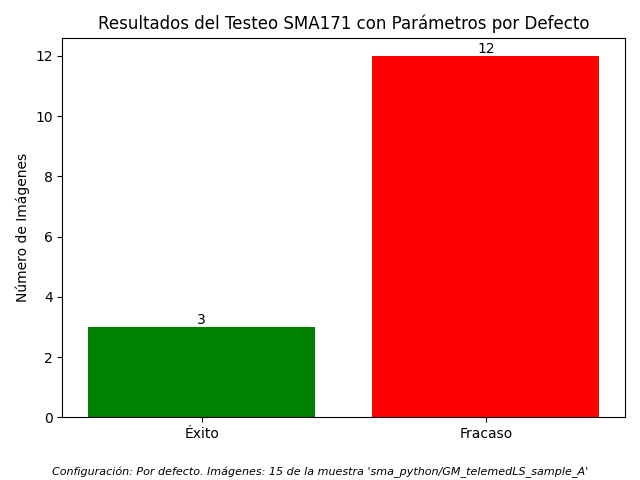
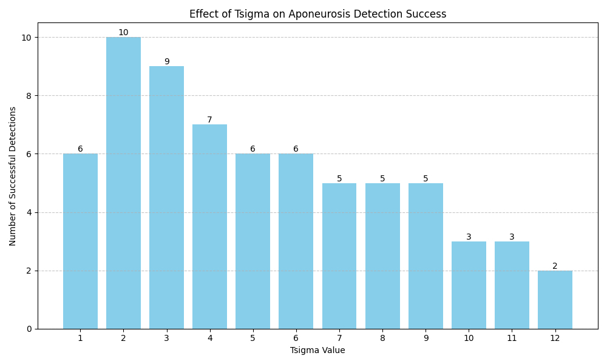

# Version final de MACRO-SMA-PYTHON
# SMA (Simple Muscle Architecture) - Versión en Python

Este repositorio contiene una implementación en Python del macro de ImageJ **SMA (Simple Muscle Architecture)**, diseñado originalmente por O. R. Seynnes y N. J. Cronin. El objetivo principal de este proyecto es ofrecer una alternativa al macro de Fiji/ImageJ que pueda ser ejecutada en un entorno de Python estándar, facilitando la automatización y el análisis por lotes sin necesidad de una interfaz gráfica.

La implementación se ha centrado en la versión **1.7.1** del macro original, buscando replicar fielmente su *pipeline* de procesamiento de imágenes para validar los resultados.

## Flujo de Procesamiento (Pipeline)

El análisis de las imágenes de ultrasonido para detectar la arquitectura muscular sigue un riguroso proceso de filtrado y detección. A continuación, se presenta un diagrama de flujo que describe cada paso clave del pipeline implementado:

```
1. INICIO: Carga de la Imagen
   |
   V
2. RECORTE AUTOMÁTICO
   (Se aísla la región del músculo del resto de la imagen)
   |
   V
3. PRE-PROCESAMIENTO
   - Sustraer Fondo (corrige brillo)
   - Reducción de Ruido (Non-local Means)
   - Filtro Paso de Banda (elimina ruido de alta/baja frecuencia)
   - Mejora de Contraste (CLAHE)
   |
   V
4. REALCE DE APONEUROSIS (FILTRO SATO - "TUBENESS")
   (Paso CRÍTICO: se realzan las estructuras con forma de línea)
   |
   V
5. LIMPIEZA ADICIONAL (FFT)
   (Se aíslan las señales más fuertes y se elimina el ruido residual)
   |
   V
6. DETECCIÓN DE BORDES (CANNY)
   (Se obtiene un mapa binario de los bordes de las aponeurosis)
   |
   V
7. FILTRADO DE CONTORNOS Y TRAZADO
   - Se eliminan los contornos que son demasiado cortos.
   - Se identifican las aponeurosis superior e inferior.
   |
   V
8. FIN: Cálculo de Parámetros
   (Grosor, ángulo de penación, etc.)
```

## Configuración del Análisis

Para mantener la fidelidad con el trabajo original, el script utiliza por defecto los **parámetros de análisis definidos por los autores** en la versión 1.7.1 del macro de Fiji. Esto asegura que los resultados sean comparables y que el pipeline funcione según fue diseñado originalmente. Los parámetros principales, como el sigma para el filtro Tubeness (`Tsigma`) o el sigma para la orientación de fascículos (`Osigma`), están preconfigurados en el script `sma_python/SMA_python_171/analysis_171.py`.

## Testeo Intensivo del Sistema

Para validar y optimizar la detección de aponeurosis, se ha desarrollado un conjunto de scripts de testeo en la carpeta `sma_python/testing_SMA171/`. El script principal es `test_intensive_sma171.py`, que realiza dos pruebas sobre el conjunto de datos de ejemplo (`sma_python/GM_telemedLS_sample_A/`).

### 1. Test con Parámetros por Defecto

La primera prueba ejecuta el pipeline sobre todas las imágenes utilizando la configuración por defecto (`Tsigma = 10`). El objetivo es evaluar el rendimiento base del sistema.

**Resultados:**



Como muestra el gráfico, con la configuración por defecto, el sistema detecta correctamente las aponeurosis en 3 de las 15 imágenes.

### 2. Test de Optimización del Parámetro `Tsigma`

La segunda prueba es un barrido del parámetro `Tsigma` desde 1 hasta 12. El objetivo es encontrar el valor óptimo de este parámetro, que es crítico para el filtro "Tubeness" encargado de realzar las aponeurosis.

**Resultados:**



El gráfico de resultados muestra claramente que el **valor óptimo para `Tsigma` es 2**, con el cual se logra el éxito en 10 de las 15 imágenes, mejorando drásticamente el rendimiento del sistema para este conjunto de datos.
